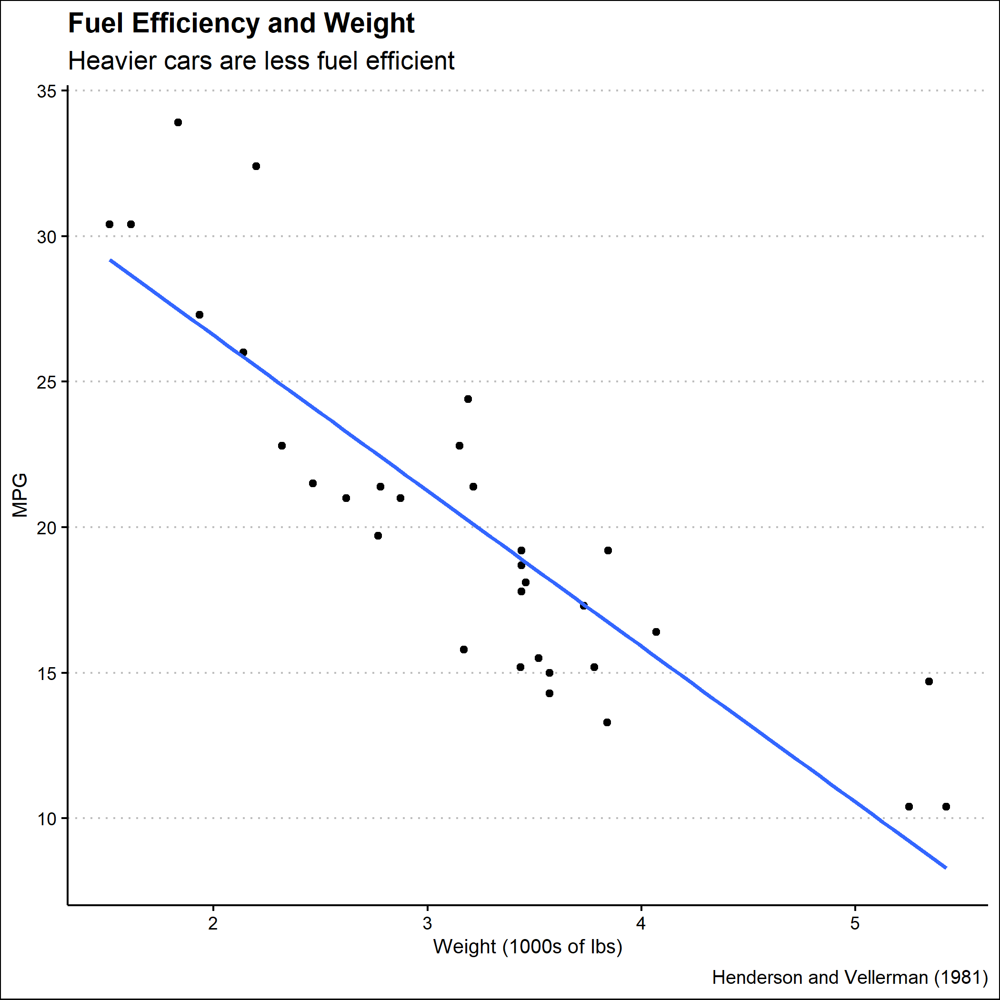

```{r setup, include=FALSE}
knitr::opts_chunk$set(echo = FALSE)
library(tidyverse)
library(ggthemes)

```
```{r car-plot}
car_plot <- mtcars |>
  select(mpg, wt) |>
  #we selected these two because we wanted the correlation between weight and mpg
  ggplot(mapping = aes(x = wt, y = mpg)) +
  geom_point() +
  geom_smooth(method = "lm", formula = y~x, se = FALSE) +
  # we added geom_smooth because we wanted to make the graph look neater and nicer
  theme_clean() +
  labs(title = "Fuel Efficiency and Weight",
       subtitle = "Heavier cars are less fuel efficient", 
       x = "Weight (1000s of lbs)",
       y = "MPG",
       caption = "Henderson and Vellerman (1981)")

write_rds(car_plot, "car-plot.rds")

car_plot <- read_rds(car-plot.rds)
car_plot
ggsave("car-plot.png", plot = car_plot)
```
```{r image}

```

